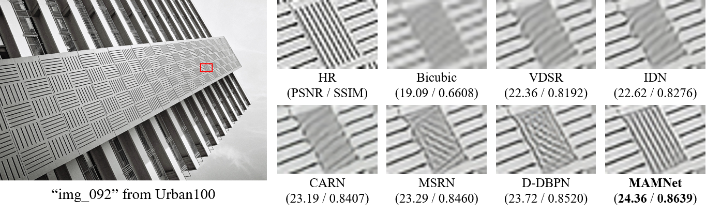
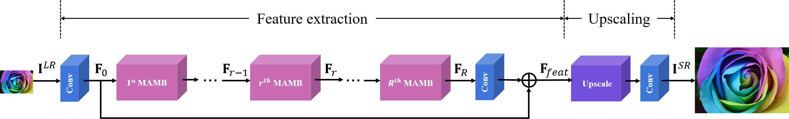
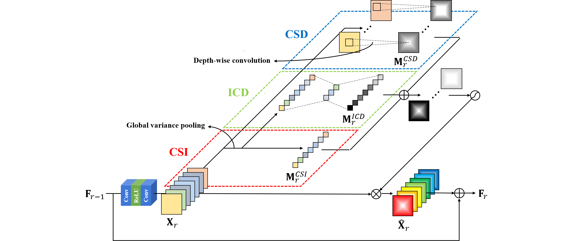

# MAMNet: Multi-path Adaptive Modulation Network for Image Super-Resolution


## Introduction
In recent years, single image super-resolution (SR) methods based on deep convolutional neural networks (CNNs) have made significant progress. However, due to the non-adaptive nature of the convolution operation, they cannot adapt to various characteristics of images, which limits their representational capability and, consequently, results in unnecessarily large model sizes.
To address this issue, we propose a novel multi-path adaptive modulation network (MAMNet).
Specifically, we propose a multi-path adaptive modulation block (MAMB), which is a lightweight yet effective residual block that adaptively modulates residual feature responses by fully exploiting their information via three paths.
The three paths model three types of information suitable for SR: 1) channel-specific information (CSI) using global variance pooling, inter-channel dependencies (ICD) based on the CSI, and channel-specific spatial dependencies (CSD) via depth-wise convolution.

The overall architecture of MAMNet is illustrated as follows:
<br/><br/><br/><br/>

<br/><br/>
The structure of MAMB is illustrated as follows:
<br/><br/>


## Training

```shell
python main.py
  --device 0
  --model_name MAMNet
  --data_dir <path of the DIV2K dataset>
  --exp_dir <path of experiments>
  --exp_name <name of experiment> 
  --num_res 64 --num_feats 64 
  --is_MAM --is_CSI --is_ICD --is_CSD 
  --scale <scaling factor> 
  --is_init_res 
  --is_train 
```

## Test

``` shell
python main.py 
  --device 0 
  --model_name MAMNet 
  --data_dir <path of datasets>
  --dataset_name <name of dataset>
  --exp_dir <path of experiments> 
  --exp_name <name of experiment>  
  --num_res 64 --num_feats 64 
  --is_MAM --is_CSI --is_ICD --is_CSD 
  --scale <scaling factor> 
  --is_test
```
